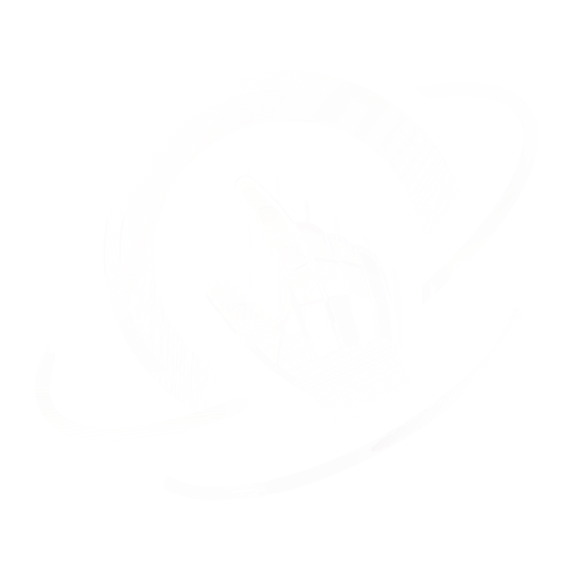
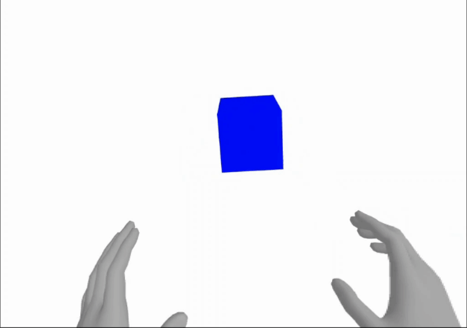

<p align="center">
  
</p>

<h1 align="center">xr</h1>
<h3 align="center">Turn any R3F app into an interactive immersive experience.</h3>
<br/>

<p align="center">
  <a href="https://npmjs.com/package/@react-three/xr" target="_blank">
    
  </a>
  <a href="https://npmjs.com/package/@react-three/xr" target="_blank">
    
  </a>
  <a href="https://twitter.com/pmndrs" target="_blank">
    
  </a>
  <a href="https://discord.gg/ZZjjNvJ" target="_blank">
    
  </a>
</p>

```bash
npm install three @react-three/fiber @react-three/xr@latest
```

## What does it look like?

| A simple scene with a mesh that toggles its material color between `"red"` and `"blue"` when clicked through touching or pointing. |  |
| ---------------------------------------------------------------------------------------------------------------------------------- | ----------------------------------------------------------------------------------------- |

```tsx
import { Canvas } from '@react-three/fiber'
import { XR, createXRStore } from '@react-three/xr'
import { useState } from 'react'

const store = createXRStore()

export function App() {
  const [red, setRed] = useState(false)
  return (
    <>
      <button onClick={() => store.enterAR()}>Enter AR</button>
      <Canvas>
        <XR store={store}>
          <mesh pointerEventsType={{ deny: 'grab' }} onClick={() => setRed(!red)} position={[0, 1, -1]}>
            <boxGeometry />
            <meshBasicMaterial color={red ? 'red' : 'blue'} />
          </mesh>
        </XR>
      </Canvas>
    </>
  )
}
```

### How to enable XR for your @react-three/fiber app?

1. `const store = createXRStore()` create a xr store
2. `store.enterAR()` call enter AR when clicking on a button
3. `<XR>...</XR>` wrap your content with the XR component

... or read this guide for [converting a react-three/fiber app to XR](https://docs.pmnd.rs/xr/getting-started/convert-to-xr).

## Tutorials

- 💾 [Store](https://docs.pmnd.rs/xr/tutorials/store)
- 👌 [Interactions](https://docs.pmnd.rs/xr/tutorials/interactions)
- 🔧 [Options](https://docs.pmnd.rs/xr/tutorials/options)
- 🧊 [Object Detection](https://docs.pmnd.rs/xr/tutorials/object-detection)
- ✴ [Origin](https://docs.pmnd.rs/xr/tutorials/origin)
- 🪄 [Teleport](https://docs.pmnd.rs/xr/tutorials/teleport)
- 🕹️ [Gamepad](https://docs.pmnd.rs/xr/tutorials/gamepad)
- ➕ [Secondary Input Sources](https://docs.pmnd.rs/xr/tutorials/secondary-input-sources)
- 📺 [Layers](https://docs.pmnd.rs/xr/tutorials/layers)
- 🎮 [Custom Controller/Hands/...](https://docs.pmnd.rs/xr/tutorials/custom-inputs)
- ⚓️ [Anchors](https://docs.pmnd.rs/xr/tutorials/anchors)
- 📱 [Dom Overlays](https://docs.pmnd.rs/xr/tutorials/dom-overlay)
- 🎯 [Hit Test](https://docs.pmnd.rs/xr/tutorials/hit-test)
- ⛨ [Guards](https://docs.pmnd.rs/xr/tutorials/guards)

## Roadmap

- 🤳 XR Gestures
- 🕺 Tracked Body
- ↕ react-three/controls

## Migration guides

- from [@react-three/xr v5](https://docs.pmnd.rs/xr/migration/from-react-three-xr-5)
- from [natuerlich](https://docs.pmnd.rs/xr/migration/from-natuerlich)

## Sponsors

This project is supported by a few companies and individuals building cutting-edge 3D Web & XR experiences. Check them out!


