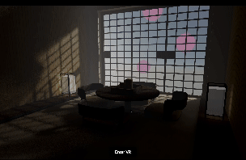

Building WebXR experiences has all the advantages of building for the web, with a lot of tool chains, debugging tools, and resources available. 
Because there are so many tools available, it is often hard to choose a development setup. Therefore, we would like to recommend you a development setup for developing with `react-three/xr`.

## 1. Build tool: [vite](https://vitejs.dev/)

Vite is easy to set up and has all the features we need. We recommend using the packages `@vitejs/plugin-react` to enable hot module reloading and `@vitejs/plugin-basic-ssl` to enable `https`, which is required for any WebXR experience.

A basic `vite.config.ts` would look like this:

```ts
import { defineConfig } from 'vite'
import react from '@vitejs/plugin-react'
import basicSsl from '@vitejs/plugin-basic-ssl'

export default defineConfig({
  plugins: [react(), basicSsl()],
})
```

Now with vite and ssl setup, we can host out application by starting executing `vite --host`. The `--host` argument makes sure that the server is exposed to your local network, so you can access the app from your headset or smartphone. When starting the server, vite also shows you your local IP. Now type in this IP including the port number into your smartphone's or headset's browser (e.g. `https://192.168.0.43:5173`).

> [!TIP]
> Type `thisisunsafe` with your keyboard to dismiss the warning:
> 


## 2. emulator: [iwer/devui](https://github.com/meta-quest/immersive-web-emulation-runtime/blob/main/devui/README.md)

Developing WebXR experiences often requires testing WebXR-specific features, which either require an actual device or an emulator. An emulator allows testing without a specific device and without continuously switching a headset on and off.

`react-three/xr` includes the [iwer/devui](https://github.com/meta-quest/immersive-web-emulation-runtime/blob/main/devui/README.md) emulator out of the box, which is in its 0.x status and very much experimental in its current stage. The emulator builds on [IWER by Meta Quest](https://github.com/meta-quest/immersive-web-emulation-runtime/) and adds a easy to use overlay on top of your application. The emulator is automatically injected if the `emulate` config has `inject` set to `true`, or if the app is served on `localhost` and if no WebXR support is detected. In case the emulator was not injected automatically, the user can inject it by pressing `Window/Command + Alt/Option + E`. After the emulator is injected, the user can press the button to enter the XR experience provided by the application.



The existing [Immersive Web Emulator](https://chromewebstore.google.com/detail/immersive-web-emulator/cgffilbpcibhmcfbgggfhfolhkfbhmik) is a extension that provides similar emulation but its current version (1.x) is not supported because it does not comply to the WebXR spec. Starting with IWE 2.0, [iwer/devui](https://github.com/meta-quest/immersive-web-emulation-runtime/blob/main/devui/README.md) will be integrated into IWE, making it compatible with react-three/xr. If you have IWE 1.x installed and active, please turn them off, as it will prevent activiting the integrated [iwer/devui](https://github.com/meta-quest/immersive-web-emulation-runtime/blob/main/devui/README.md). 

Another supported alternative is the Apple Vision Pro Simulator.

## 3. ADB

Sometimes, a WebXR experience works flawlessly in the emulator but fails on the actual device. In this case we recommend using Android Device Bridge (ADB) to debug your experience from another device. For example, to remotely debug a WebXR experience on a Meta Quest 3, the Meta Quest 3 must be in developer mode, and remote debugging must be enabled. Then, the Meta Quest 3 must be connected to a PC via a USB cable with ADB installed. With this setup, the Chrome browser can now be used to access `chrome://inspect` to inspect specific tabs on the device remotely.

If you are using the Apple Vision Pro, there are similar features to remotely debug a WebXR experience on the Apple Vision Pro from a Safari browser on another device. 
