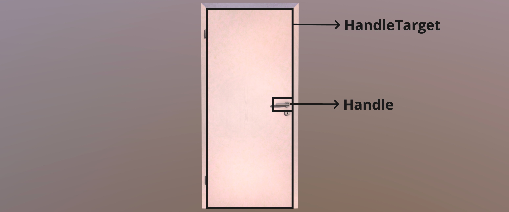
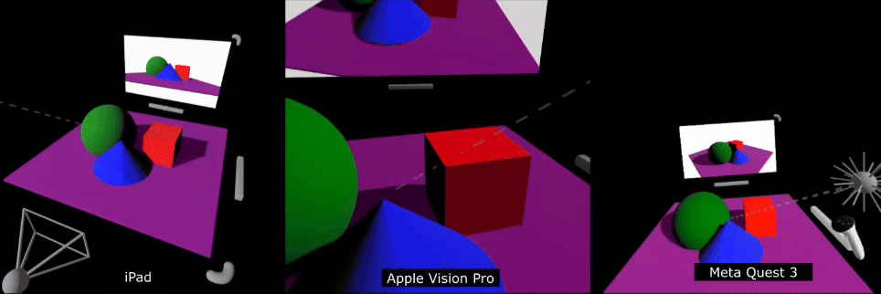
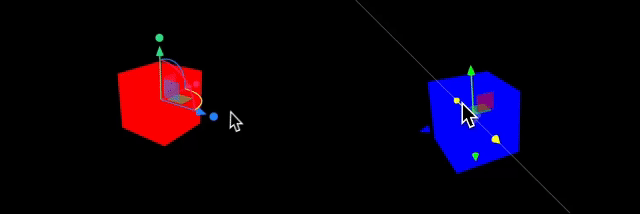

Handles are everywhere, from scrollbar thumbs to window bars to door handles.


Handles make it possible to move, rotate, and scale 2D or 3D objects using intuitive gestures. `@react-three/handle` makes it super simple to build these intuitive 3D handles for XR and non-XR devices with only a few lines of code. Let's showcase that while building a 3D door.

  
_Door model from [witnessk](https://sketchfab.com/witnessk)_

To build our door, we have two components: the door handle and the door body, which the handle should rotate when grabbed. Therefore, the door body is the handle target, on which the transformations from the handle should be applied.

We can build this door by downloading the GLTF model from Sketchfab and transforming the model into its individual parts using [gltfjsx](https://gltf.pmnd.rs/). This separates the door frame, the door body, and the door handle, allowing us to wrap the door handle with the `<Handle>` component and the door body with the `<HandleTarget>` component.

```tsx {6,10,14-15}
export function Door() {
  const { nodes, materials } = useGLTF('/door.glb')
  return (
    <group rotation={[-Math.PI / 2, 0, 0]} scale={100}>
      <group position={[-0.435, -0.101, 0.249]}>
        <HandleTarget>
          <mesh geometry={nodes.Plane001_Glossy_0.geometry} material={materials.Glossy} />
          <mesh geometry={nodes.Plane001_Door_0.geometry} material={materials.Door} />
          <mesh geometry={nodes.Plane003_Door_0.geometry} material={materials.Door} position={[0.852, 0.017, 0.782]} />
          <Handle targetRef="from-context" translate="as-rotate" rotate={{ x: false, y: false, z: [-Math.PI, 0] }}>
            <group position={[0.81, 0.043, 0.803]}>
              <mesh geometry={nodes.Circle002_Glossy_0.geometry} material={materials.Glossy} />
            </group>
          </Handle>
        </HandleTarget>
      </group>
      <mesh geometry={nodes.Plane002_Glossy_0.geometry} material={materials.Glossy} />
      <mesh geometry={nodes.Plane002_Door_0.geometry} material={materials.Door} />
    </group>
  )
}
```

Next, we need to configure the handle to rotate the door when grabbed. We instruct it to use the target from the context using `targetRef="from-context"`, making sure the transformations are applied to the door body. Additionally, we ensure that moving the handle is translated into a rotation using the `translate="as-rotate"` property. Lastly, we disable rotations on all axes except for the `z` axis and limit the rotation between -180° and 0°.

*Learn more about all the available properties for the handle component [here](./handle-component.md).*

The final result looks like this (I added an additional handle around the door handle that allows it to rotate on its own y-axis).


### Editor Example

Handles are made for all kinds of use cases, from games to professional applications, which we emphasized by building the following editor demo that uses over 40 handles for moving the elements on the screen, resizing the virtual screen, and moving the virtual camera. The nice part is that it works on all devices, ranging from mouse-driven PCs to eye-driven mixed-reality headsets (Apple Vision Pro).



You can check it out [here](https://pmndrs.github.io/xr/examples/editor/) and read the source code (700 LOC) [here](https://github.com/pmndrs/xr/tree/main/examples/editor/app.tsx).

### Screen Handles

A specific type of handle is the screen handle, where not an individual object is the handle, but the whole screen. Therefore, we build screen handles, which allow panning, zooming, and rotating the camera using swipe, drag, and scroll interactions. These are built on the ideas of `OrbitControls` and `MapControls` from Three.js, but respect the event system (e.g., you don't need to disable them when you drag an object) and are automatically forwarded to virtual screens, as shown in the editor demo.

Learn more about the available screen handles [here](./screen-handle-components.md).

### Prebuilt Handles

For many use cases, such as 3D editors, handles often come in specific forms, like the `TransformControls` available in Three.js. These opinionated pre-built handles have proven to be very useful, which is why `@react-three/handle` ships with implementations for `TransformHandles` and `PivotHandles`.



Learn more about the available prebuilt handles [here](./screen-handle-components.md).

## Sponsors

This project is supported by a few companies and individuals building cutting-edge 3D Web & XR experiences. Check them out!

