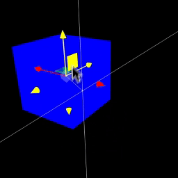
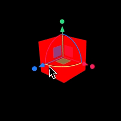

The `Handle` component allows for the orchestration of multiple handles together to achieve interactions typically found in 3D editors, such as the `TransformControls` offered by Three.js. Since these prebuilt handles are commonly used, `@react-three/handles` includes two of them: `TransformHandles` (based on TransformControls from Three.js) and `PivotHandles` (based on PivotControls from @react-three/drei). These prebuilt handles can be used in XR and non-XR environments, are highly configurable for use cases including multi-user editing, can be utilized through virtual screens, and respect the event system of the scene, preventing accidental interactions with multiple objects at once.

Using the `TransformHandles` and `PivotHandles` in React Three Fiber requires disabling the built-in event system and adding the event system of `@react-three/xr`.

```tsx
import { TransformHandles } from '@react-three/handle'
import { noEvents, PointerEvents } from '@react-three/xr'

<Canvas events={noEvents}>
  <PointerEvents />
  <TransformHandles>
    <mesh>
      <boxGeometry />
    </mesh>
  </TransformHandles>
</Canvas>
```

## Transform Handles  
*Alias for `TransformControls`*



### Properties

**alwaysUpdate**  
In situations where the transform handles are placed inside a constantly changing group, the `alwaysUpdate` flag ensures that the transform handles' transformation is updated every frame to reflect the current state of the handle.

**apply**  
Allows overriding the default apply function, giving the developer complete control over how modifications affect the state. For instance, instead of applying the modification directly, the developer can apply it to their own state management solution. The state management solution can then apply the modification to the handle target.

**stopPropagation**  
Setting `stopPropagation` to `false` will re-enable event propagation for events that occur on the handles.

**space**  
Allows configuring whether the transformations should happen in `"local"` or `"world"` space. This property has no effect when the `mode` property is set to `scale`, as scaling must occur on the local axis.

**mode**  
Allows configuring whether the transformation should be `"translate"`, `"rotate"`, or `"scale"`, which also changes the visualization of the transform handles.

**x**  
Allows configuring the transformation on the x-axis. Setting `x` to `false` disables transformations on the x-axis and also hides the respective user interface.

**y**  
Allows configuring the transformation on the y-axis. Setting `y` to `false` disables transformations on the y-axis and also hides the respective user interface.

**z**  
Allows configuring the transformation on the z-axis. Setting `z` to `false` disables transformations on the z-axis and also hides the respective user interface.

**e**  
The `e` axis represents the axis for rotating the transform handles in screen space, which is only available when `mode` is set to `rotation`. Setting `e` to `false` disables rotation in screen space and also hides the respective user interface.

**enabled**  
Setting `enabled` to `false` momentarily disables the transform handles.

**fixed**  
By default, the transform handles have a fixed size independent of their distance from the camera, which means they scale up when they move away from the camera. Setting `fixed` to `false` will make them appear smaller when further away from the camera.

**size**  
The `size` property allows configuring the size of the transform handles, which has no effect on their contents.

## Pivot Handles  
*Alias for `PivotControls`*

In contrast to the transform handles, the pivot handles only operate in local space but allow rotation, scaling, and translation transformations simultaneously.



### Properties

**scale**  
The `scale` property allows configuring if and how the user can scale the pivot handles. Setting `scale` to `false` disables scaling. Setting `scale` to `x` restricts scaling to the x-axis and only shows the user interface elements for scaling on the x-axis. Similarly, setting `scale` to `{ x: false }` hides the user interface elements for scaling on the x-axis and only allows scaling on the y- and z-axes.

**translation**  
The `translation` property allows configuring if and how the user can translate the pivot handles. Setting `translation` to `false` disables translation. Setting `translation` to `x` restricts translation to the x-axis and only shows the user interface elements for translation on the x-axis. Similarly, setting `translation` to `{ x: false }` hides the user interface elements for translation on the x-axis and only allows translation on the y- and z-axes.

**rotation**  
The `rotation` property allows configuring if and how the user can rotate the pivot handles. Setting `rotation` to `false` disables rotation. Setting `rotation` to `x` restricts rotation to the x-axis and only shows the user interface elements for rotating on the x-axis. Similarly, setting `rotation` to `{ x: false }` hides the user interface elements for rotating on the x-axis and only allows rotation on the y- and z-axes.

**alwaysUpdate**  
In situations where the pivot handles are placed inside a constantly changing group, the `alwaysUpdate` flag ensures that the pivot handles' transformation is updated every frame to reflect the current state of the handle.

**apply**  
Allows overriding the default apply function, giving the developer complete control over how modifications affect the state. For instance, instead of applying the modification directly, the developer can apply it to their own state management solution. The state management solution can then apply the modification to the handle target.

**stopPropagation**  
Setting `stopPropagation` to `false` will re-enable event propagation for events that occur on the handles.

**enabled**  
Setting `enabled` to `false` momentarily disables the pivot handles.

**fixed**  
By default, the pivot handles have a fixed size independent of their distance from the camera, which means they scale up when they move away from the camera. Setting `fixed` to `false` will make them appear smaller when further away from the camera.

**size**  
The `size` property allows configuring the size of the pivot handles, which has no effect on their contents.