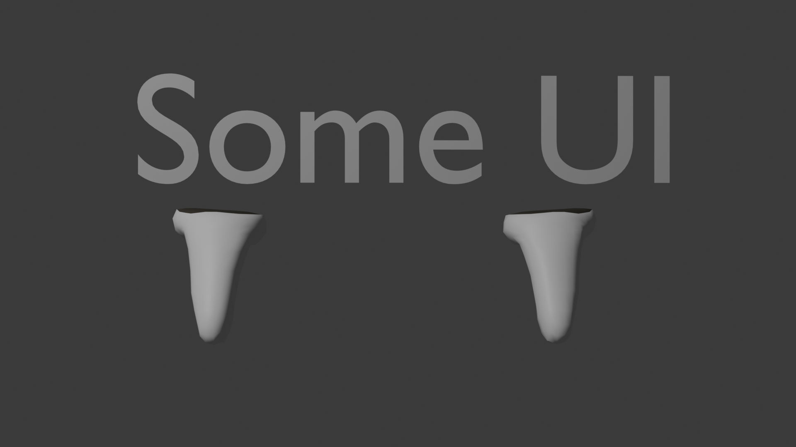
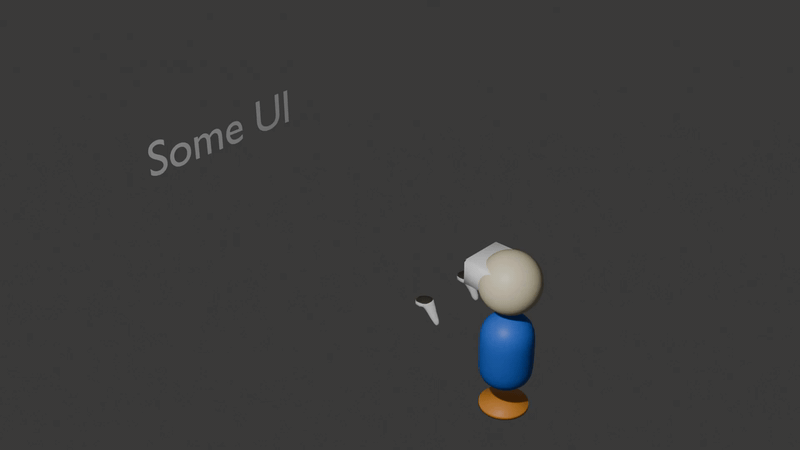

A heads up display is a fairly easy thing to implement in **React Three XR**. Because it's such a popular feature, this tutorial outlines a simple and effective method for adding a heads up display to your React Three XR applications.


### Setup

First thing to do is to create a new React Three XR project, and import [UIKit](https://pmndrs.github.io/uikit/docs/getting-started/introduction). We will use UIKit to create the elements of our heads up display.

`npm i @react-three/uikit`

Next, we need a basic scene to start out with. Put the following code in your `app.tsx` file:

```tsx
import { Box } from '@react-three/drei'
import { Canvas } from '@react-three/fiber'
import { createXRStore, XR } from '@react-three/xr'
import * as THREE from 'three'
import './styles.css'

const store = createXRStore()

const axisColor = new THREE.Color('#9d3d4a')
const gridColor = new THREE.Color('#4f4f4f')

export function App() {
  return (
    <div className="App">
      <Canvas camera={{ position: [5, 3, 5] }}>
        <color attach={'background'} args={['#3f3f3f']} />
        <gridHelper args={[50, 50, axisColor, gridColor]} />
        <XR store={store}>
          <Plane args={[10, 10]} rotation={[-Math.PI / 2, 0, 0]}>
            <meshBasicMaterial color={'darkgreen'} />
          </Plane>
        </XR>
      </Canvas>
      <button className="enterVRButton" onClick={() => store.enterVR()}>
        {'Enter VR'}
      </button>
    </div>
  )
}
```

And the following in your `styles.css` file:

```css
html {
  box-sizing: border-box;
  margin: 0;
  padding: 0;
}

body {
  margin: 0;
}

.App {
  font-family: sans-serif;
  text-align: center;
  width: 100vw;
  height: 100vh;
}

.enterVRButton {
  position: fixed;
  left: 2rem;
  top: 2rem;
}
```

### Creating the Heads Up Display Component

Now that we have the basic scene, it's on to the fun bit! Create a new file called `HUD.tsx`, and fill it with a new function component.

```tsx
export function HUD() {
  return (
    <>
    </>
  )
}
```

With our component created, it's time to get to work on our heads up display! For that we need to think a little bit about how the heads up display actually works. Essentially, our plan here is to take bits of UI in our scene and parent them to the xr camera so that when the user moves their head, the UI moves in sync in front of them. From the user's perspective, the UI will appear basically 2D in front of them. Like so:



Though in reality, if the user could see themselves in 3rd person, it would look more like this:



With our plan figured out, let's add some UI to the scene, and parent it to the camera. We'll start by importing UIKit, and placing the `<XROrigin />`, a `<group>` for all of our HUD elements, and a UIKit container in the return of our function component.

```tsx
import { Container } from '@react-three/uikit'
import { XROrigin } from '@react-three/xr'

export function HUD() {
  return (
    <>
      <XROrigin />
      <group>
        <Container>
        </Container>
      </group>
    </>
  )
}
```

With that done, we need something to display in our heads up display. A common element in heads up displays is a clock, so that seems like the perfect thing to include in our component. Here is a simple hook that will display the current time, updating every second. Create a new file called `useGetTime.ts` and add the following code:

```tsx
import { useEffect, useState } from 'react'

export const useGetTime = () => {
  const [time, setTime] = useState(() => new Date())

  useEffect(() => {
    const id = setInterval(() => setTime(new Date()), 1000)
    return () => clearInterval(id)
  }, [])

  return time
}
```

Now let's use the hook in our HUD component. Import the hook, and then call it at the top of the component. Add a UIKit `<Text>` component inside our `<Container>`, and then display the returned time from our hook inside the `<Text>` component

```tsx
// Import Text
import { Container, Text } from '@react-three/uikit'
import { XROrigin } from '@react-three/xr'
// Import our new hook
import { useGetTime } from './useGetTime'

export function HUD() {
  // Get the time
  const time = useGetTime()
  return (
    <>
      <XROrigin />
      <group>
        <Container >
        {/*Display the time here*/}
          <Text fontSize={2} color={'white'}>
            {time.toLocaleTimeString()}
          </Text>
        </Container>
      </group>
    </>
  )
}
```

We have our UI figured out, the last part of our puzzle is to attach it to the camera. To do that, we are going to need to get references to both our camera and group using a `useRef` hook, and then use a `useEffect` hook to parent our `<group>` to the camera. We'll also do some positioning of the group to make sure that the UI shows up in the top left of the user's view and isn't blurry.

> [!TIP]
> If your UI looks blurry, it's probably too close to the camera. Try moving it further away.

```tsx
import { Container, Text } from '@react-three/uikit'
import { XROrigin } from '@react-three/xr'
import { useGetTime } from './useGetTime'
// Import useEffect and useRef 
import { useEffect, useRef } from 'react'

export function HUD() {
  const time = useGetTime()
  // Create refs to our group and XROrigin
  const groupRef = useRef<THREE.Group | null>(null)
  const cameraRef = useRef<THREE.Group | >(null)

  // Attach the group to the camera on mount
  useEffect(() => {
    if (!groupRef.current || !originRef.current?.children[0]) return

    // Store references in local variables inside the useEffect in case they change
    const contextSafeGroupRef = groupRef.current
    // Drill down to get the actual camera
    const contextSafeCameraRef = originRef.current?.children[0]

    // Position the group in front of the camera, and to the left a bit
    contextSafeGroupRef.position.set(-0.2, 0.2, -0.8)
    // Reset any rotations
    contextSafeGroupRef.quaternion.identity()

    contextSafeCameraRef.add(contextSafeGroupRef)
    return () => {
      contextSafeCameraRef.remove(contextSafeGroupRef)
    }
  }, [])

  return (
    <>
      {/* Add the refs to the components */}
      <XROrigin ref={originRef} />
      <group ref={groupRef}>
        <Container>
          <Text fontSize={2} color={'white'}>
            {time.toLocaleTimeString()}
          </Text>
        </Container>
      </group>
    </>
  )
}
```

We're almost done, we have just one more small issue to work out. Remember earlier when we said that the UI would appear basically 2D in front of the user, but that it's actually still just 3D objects in the scene? This becomes a problem when the user moves too close to other objects in the scene. It's possible that the heads up display elements will be occluded in that case. To fix this, we can turn off depth testing on our `<Text>` component (and any other elements that you wish to add to your HUD). Turning off depth testing tells Three.js to always render that object on top of everything else in the scene. For good measure, we can also add a `renderOrder` of 1000 to our `<group>` to make sure that it gets rendered last.

```tsx
import { Container, Text } from '@react-three/uikit'
import { XROrigin } from '@react-three/xr'
import { useEffect, useRef } from 'react'
import * as THREE from 'three'
import { useGetTime } from './useGetTime.js'

export function HUD() {
  const time = useGetTime()
  const groupRef = useRef<THREE.Group | null>(null)
  const originRef = useRef<THREE.Group | null>(null)

  useEffect(() => {
    if (!groupRef.current || !originRef.current?.children[0]) return
    const contextSafeGroupRef = groupRef.current
    const contextSafeCameraRef = originRef.current?.children[0]

    contextSafeGroupRef.position.set(-0.2, 0.2, -0.8)
    contextSafeGroupRef.quaternion.identity()

    contextSafeCameraRef.add(contextSafeGroupRef)
    return () => {
      contextSafeCameraRef.remove(contextSafeGroupRef)
    }
  }, [])

  return (
    <>
      <XROrigin ref={originRef} />
      {/* Render order of 1000 */}
      <group ref={groupRef} renderOrder={1000}>
        {/* Turn off depth testing */}
        <Container depthTest={false}>
          {/* Turn off depth testing */}
          <Text fontSize={2} depthTest={false} color={'white'}>
            {time.toLocaleTimeString()}
          </Text>
        </Container>
      </group>
    </>
  )
}
```

With that our heads up display is complete! Just add the `<HUD />` component to the scene that we created at the beginning

```tsx
import { Box } from '@react-three/drei'
import { Canvas } from '@react-three/fiber'
import { createXRStore, XR } from '@react-three/xr'
import * as THREE from 'three'
import './styles.css'

const store = createXRStore()

const axisColor = new THREE.Color('#9d3d4a')
const gridColor = new THREE.Color('#4f4f4f')

export function App() {
  return (
    <div className="App">
      <Canvas camera={{ position: [5, 3, 5] }}>
        <color attach={'background'} args={['#3f3f3f']} />
        <gridHelper args={[50, 50, axisColor, gridColor]} />
        <XR store={store}>
          <Plane args={[10, 10]} rotation={[-Math.PI / 2, 0, 0]}>
            <meshBasicMaterial color={'darkgreen'} />
          </Plane>
          {/* Add the HUD component here */}
          <HUD />
        </XR>
      </Canvas>
      <button className="enterVRButton" onClick={() => store.enterVR()}>
        {'Enter VR'}
      </button>
    </div>
  )
}
```

Feel free to experiment with adding more elements to your heads up display. [Link to the complete example here](https://pmndrs.github.io/xr/examples/heads-up-display). Happy coding!