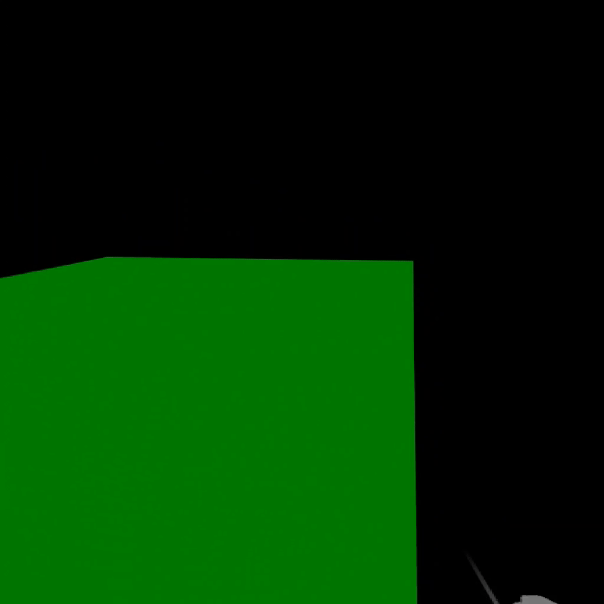

First we need to enable the teleport pointer inside the hands and controllers.

```tsx
const store = createXRStore({
  hand: { teleportPointer: true },
  controller: { teleportPointer: true },
})
```

Secondly, we need to control out own state because that gives us the complete control when teleportation should be mixed with more complex behaviors. Therefore we're using `useState` to store the current position. But we can also use any other local or global state manager.

```tsx
const [position, setPosition] = useState(new Vector3())
```

Next, we need to use the position to control the user's origin.

```tsx
<XROrigin position={position}>
```

Lastly, we need to add a teleport target to our scene. In this case, we're using a simple 10x10 meter green box. We need to bind our `setPosition` function to the `onTeleport` handler of the `TeleportTarget` to update the user's position whenever the user teleports.

```tsx
<TeleportTarget onTeleport={setPosition}>
    <mesh scale={[10, 1, 10]} position={[0, -0.5, 0]}>
        <boxGeometry />
        <meshBasicMaterial color="green" />
    </mesh>
</TeleportTarget>
```

Combined, this example looks like this.

```tsx

const store = createXRStore({
  hand: { teleportPointer: true },
  controller: { teleportPointer: true },
})

export function App() {
  const [position, setPosition] = useState(new Vector3())
  return (
    <>
      <button onClick={() => store.enterVR()}>Enter VR</button>
      <Canvas>
        <XR store={store}>
          <ambientLight />
          <XROrigin position={position} />
          <TeleportTarget onTeleport={setPosition}>
            <mesh scale={[10, 1, 10]} position={[0, -0.5, 0]}>
              <boxGeometry />
              <meshBasicMaterial color="green" />
            </mesh>
          </TeleportTarget>
        </XR>
      </Canvas>
    </>
 )
}
```

