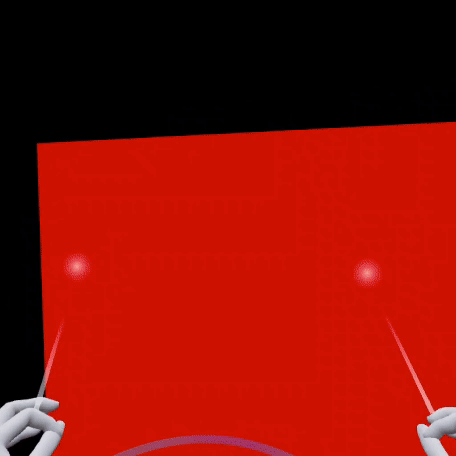

<h1 align="center">@react-three/handle</h1>
<h3 align="center">The one to handle them all 👌</h3>
<br/>

<p align="center">
  <a href="https://npmjs.com/package/@react-three/handle" target="_blank">
    
  </a>
  <a href="https://npmjs.com/package/@react-three/handle" target="_blank">
    
  </a>
  <a href="https://twitter.com/pmndrs" target="_blank">
    
  </a>
  <a href="https://discord.gg/ZZjjNvJ" target="_blank">
    
  </a>
</p>

```bash
npm install three @react-three/fiber @react-three/handle@latest @react-three/xr@latest
```

| A example with a handle for controlling the scale rotation and position of a simple red cube by grabbing it with any type of input (mouse, touch, grab, point) in XR and non-XR applications. |  |
| ---------------------------------------------------------------------------------------------------------------------------------- | ----------------------------------------------------------------------------------------- |

```tsx
import { Canvas } from '@react-three/fiber'
import { noEvents, PointerEvents } from '@react-three/xr'
import { Handle } from '@react-three/handle'

export function App() {
  return (
    <Canvas events={noEvents}>
      <PointerEvents />
      <Environment preset="city" />
      <Handle>
        <mesh position-z={-1}>
          <boxGeometry />
          <meshStandardMaterial color="red" />
        </mesh>
      </Handle>
    </Canvas>
  )
}
```

# [Documentation](https://pmndrs.github.io/xr/docs/handles/)

## Sponsors

This project is supported by a few companies and individuals building cutting-edge 3D Web & XR experiences. Check them out!


